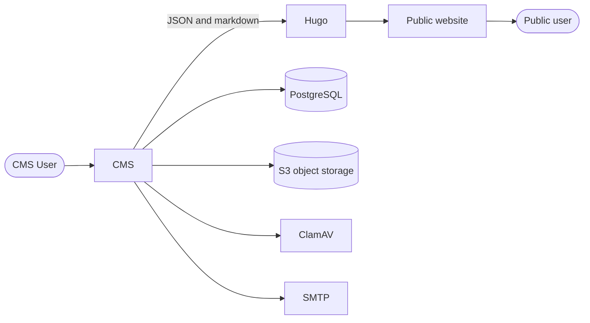

# Verwerkingsregister

## Introduction

Under the GDPR (AVG) and the Dutch police data act (WPG), public bodies must keep a record of every processing activity involving personal data, and publish that record. The Verwerkingsregister is the web application in which the Ministerie van Volksgezondheid, Welzijn en Sport (VWS) and the associated organisations do both: maintain their records in a structured, uniform way, and publish the approved versions to a public website.

**Target audience**

Privacy professionals within the VWS group: data entry staff (*invoerders*), (Chief) Privacy Officers, Data Protection Officers (*functionarissen gegevensbescherming*), mandate holders (*mandaathouders*) who formally approve records, and read-only consultants. Members of the public are the audience for the published website. See [docs/roles_and_permissions.md](docs/roles_and_permissions.md) for the full role model.

**Function and purpose**

- Holds five registers: AVG processing records as controller (*AVG verantwoordelijke verwerkingen*), AVG processing records as processor (*AVG verwerker verwerkingen*), WPG processing records (*WPG verantwoordelijke verwerkingen*), algorithms, and data breaches.
- Records relations between processing activities, organisations, systems, processors, receivers and other entities, so the register stays coherent instead of being a set of unrelated forms.
- Stores supporting documents (DPIAs, contracts) with the record they belong to, and warns users by email when a document is about to expire or a record is due for periodic review.
- Runs a formal approval process: a record version is frozen into a snapshot, mandate holders approve it, and only then is it established.
- Publishes established snapshots as a public static website, so the legally required publication follows from the same source as the internal administration.

## Repository layout

This project has 2 main components:

**CMS**

The CMS is built using [Laravel](https://laravel.com/). This is where all the data for the processing records (verwerkingen) are kept and maintained.

Directory: `/src/cms/`

**Static website**

This contains the configuration for generating a static website using [Hugo](https://gohugo.io/). It uses JSON and markdown data as its input to generate static html files.

Directory: `/src/static-website/`

## Documentation




The application has no API of its own and calls no external API. At runtime it talks to PostgreSQL, S3 compatible object storage, ClamAV, an SMTP server. Only the public website is reachable from the internet.


- See [docs/tech_stack.md](docs/tech_stack.md) for the languages and frameworks used
- See [docs/database.md](docs/database.md) for the database details, schema versioning and how the SQL files for a release are generated
- See [docs/database.md](docs/database.md) for the database type and version, the schema, and how the schema is versioned and deployed.
- See [docs/environment_variables.md](docs/environment_variables.md) for an overview of all environment variables that can be set in the `.env` file.
- See [docs/roles_and_permissions.md](docs/roles_and_permissions.md) for an overview of all roles and permissions and the location where they are configured.
- See [docs/scheduled_tasks.md](docs/scheduled_tasks.md) for the periodic tasks, when they run and what depends on them.

## Getting started
> All `artisan` commands must be run via Sail (`sail artisan ...` or inside `sail shell`).
> Running `php artisan` directly on your host will fail because `DB_HOST=pgsql` is only reachable inside Docker.

### Prerequisites

-   An up-to-date [Docker (Desktop)](https://www.docker.com/products/docker-desktop/) installation

### Setup CMS

1. Open a new terminal at `/src/cms`
2. Create an `.env` file by copying the `./.env.example` to `./.env`
3. Setup docker using laravel/sail by running:

    ```
    docker run --rm \
        -u "$(id -u):$(id -g)" \
        -v "$(pwd):/var/www/html" \
        -w /var/www/html \
        laravelsail/php84-composer:latest \
        composer install --ignore-platform-reqs
    ```

    For more information see: https://laravel.com/docs/10.x/sail#installing-composer-dependencies-for-existing-projects

    (The steps below assume you have an alias for `./vendor/bin/sail`)

4. Start the container by running `sail up -d`
5. Run `sail artisan key:generate` to generate a new application key
6. Run `sail artisan migrate:fresh --seed` to (re)run all migrations and default seeder

As a result of these steps, you have created your local docker working directory, a database and seeded it with a user.

### Setup Public website

We now need the Public website script to build the static files within your container.

1. Open the shell with `sail shell`
2. Run `npm ci` (NPM clean install) to install the required dependencies. If you visit your local website (in your browser) you should see a warning that says something like `Vite manifest not found at: /var/www/html/public/build/manifest.json`.
3. Run `npm run build` (within the shell) to build the static files. This will generate the static files in the `public` folder.
4. Exit the shell  (`exit`).
5. Run `sail artisan storage:link` to link the configured (default) /static-website to the actual static files of the website.
6. Run `sail artisan static-website:refresh` to generate the public website content from the CMS database.


As a result of these steps, you have created the static files for the public website and in your browser you can see the Login page.
- Navigate to http://localhost/static-website (or http://web.cms.orb.local/static-website for Orbstack users)

### Login to the CMS

1. Visit the project in your browser
2. Login with the following credentials:
    - Email: `admin@minvws.nl` (this user is added with the TestDataSeeder)
3. Open your local Mailpit instance to see the email that is send
4. Click on the link in the email to login
5. Add the 2FA code which you do not have

#### 2FA options

To be able to login, you have three options:

A. Set ENV variable `ONE_TIME_PASSWORD_DRIVER` to `fake` in your `.env` file
   1. Open the `.env` file
   2. Add `ONE_TIME_PASSWORD_DRIVER=fake` to the file
   3. Visit your local default project url again and use a random 6-digit code for 2FA

B. Disable 2FA for the added user
  1. `sail shell` to enter the Shell
  2. `php artisan user:disable-otp`
  3. add the email again and press Enter
  4. Visit your local default project url again and you are now logged in

C. Create a new admin user with 2FA disabled
   1. `sail shell` to enter the Shell
   2. `php artisan user:create-admin`
   3. add the name and desired (fake) email you want to use to login
   4. Visit your local default project url again and login (with the email you just added)

Note: to actually use the CMS, you must have 2FA activated.

### Local CI checks

The current CI workflow consists of static code analysis and automated tests. The latter requires a local 'testing' database.
You can use the testing database (which is available by default), which requires to run the migrations there:

1. Bash into the sail-container: `php artisan sail`
2. Run `DB_DATABASE=testing php artisan migrate:fresh` to (re)run all migrations
3. Run the test: `php artisan test --testsuite=Unit,Feature` (optionally with the `--coverage` parameter)

#### Browser tests

The `Browser` testsuite drives a real Chromium through Playwright, so it is kept out of the runs
above. It needs a one-off browser download before it can run:

1. `npm install`
2. `npx playwright install chromium`
3. `npm run build` — the tests assert on compiled CSS, so a stale `public/build` makes them fail
4. `composer run-script test-browser`

#### Alternative
Execute the following bin script to run all CI checks: `./bin/ci-local`

## Workflows

-   rdo-package.yml
    -   Build the zip file (used by iRealisatie) for the dataprocessing register

## License

The source code is released under the [EUPL license](./LICENSES/EUPL-1.2.txt).
The documentation is released under the [CC0 license](./LICENSES/CC0-1.0.txt).
The EUPL 1.2 and the CC0 do not apply to photos, videos, infographics, fonts or other forms of media.
Specifically the rijkslogo and rijkshuisstijl have specific [terms of use](./LICENSES/LicenseRef-Rijkshuisstijl.txt).
Some images have a specific [terms of use from Unsplash](./LICENSES/LicenseRef-Unsplash.txt).

This repository follows the [REUSE Specfication v3.3](https://reuse.software/spec/).
Please see [REUSE.toml](./REUSE.toml) and the individual `*.license` files for copyright and license information.
