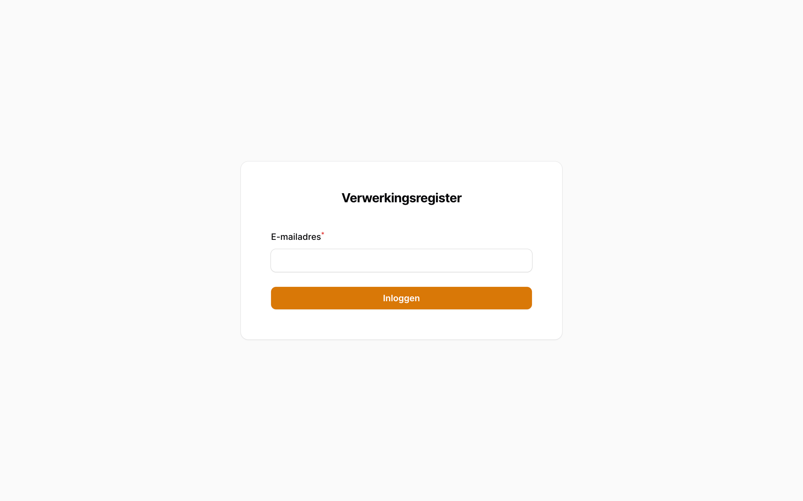

# Welkom

Vanuit DICIO ontving iRealisatie het verzoek om een nieuw verwerkingsregister te ontwikkelen en tijdelijk te beheren waarmee het ministerie van Volksgezondheid, Welzijn en Sport (VWS) en haar ZBO’s alle verwerkingen van persoonsgegevens kunnen bijhouden en publiceren.

## Het Verwerkingsregister

Zoals beschreven in de originele samenwerkingsovereenkomst:

> Het Verwerkingsregister een webapplicatie met formulieren, toegankelijk voor medewerkers van zowel het Ministerie als de rest van het concern (zoals ZBO’s) die eenduidige en gestructureerde invulling van het register faciliteert. Het biedt import functionaliteit voor bestaande registers op basis van JSON uit bestaande applicatie met faciliteert handmatige aanvulling van deze geïmporteerde gegevens. Het staat koppeling met documenten gerelateerd aan een verwerking toe, waarbij deze documenten ook in het systeem opgeslagen worden. Met een administratieportaal voor gebruikers en daaraan gerelateerde rollen en rechten. Wat ervoor zorgt dat een gebruiker online waarschuwingen ontvangt van (binnenkort) verlopen documenttermijnen, bijvoorbeeld van DPIA’s. Mét functionaliteit om een algoritme te registreren, als een bijzondere vorm van verwerkingen. Met een datalekregister waar Privacy Officers datalekken kunnen registreren, expertoren en eventueel kunnen melden bij Chief Privacy Officer. Een back-end systeem waarin relaties tussen entiteiten en (sub)verwerkingen vastgelegd worden, en dat zorgt voor geautomatiseerde voorgestelde veranderingen. Een systeem dat alerting ondersteunt, bijvoorbeeld door een email te sturen wanneer een document zijn geldigheid gaat verliezen of wanneer een taak voor een gebruiker klaar staat.

Dit systeem is gebouwd in de periode nov 2023 t/m mei 2024. Dit document is de bijbehorende handleiding.

## Details

Generieke informatie omtrent het Verwerkingsregister:

- url: [https://balie.dpr.irealisatie.nl/](https://balie.dpr.irealisatie.nl/)
- codebase: PHP, Laravel, Filament
- helpdesk: helpdesk@irealisatie.nl

## Inloggen

Voor toegang tot het Verwerkingsregister zult u moeten beschikken over een account ent een authenticator applicatie.

### Een account op het Verwerkingsregister

Voordat u in kunt loggen heeft u een account nodig: neem hiervoor contact op met uw Chief Privacy Officer.

### Een authenticator applicatie

De applicatie is beschermd met 2 Factor Authentication, ook wel bekend als One Time Password protection. Hiervoor heeft u een van de volgende apps nodig op uw mobiele device:

 1. Microsoft Authenticator: [Android App](https://play.google.com/store/apps/details?id=com.azure.authenticator&hl=nl&gl=US) / [iPhone App](https://apps.apple.com/nl/app/microsoft-authenticator/id983156458)
 2. Google Authenticator: [Android App](https://play.google.com/store/apps/details?id=com.google.android.apps.authenticator2) / [iPhone App](https://apps.apple.com/nl/app/google-authenticator/id388497605)
 3. FreeOTP Authenticator: [Website](https://freeotp.github.io/)
