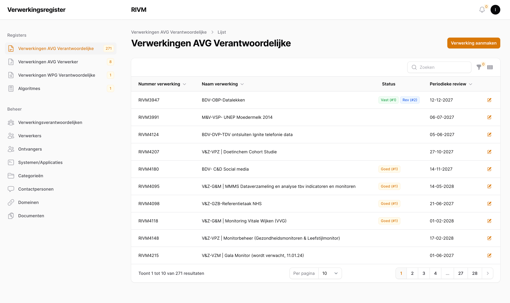
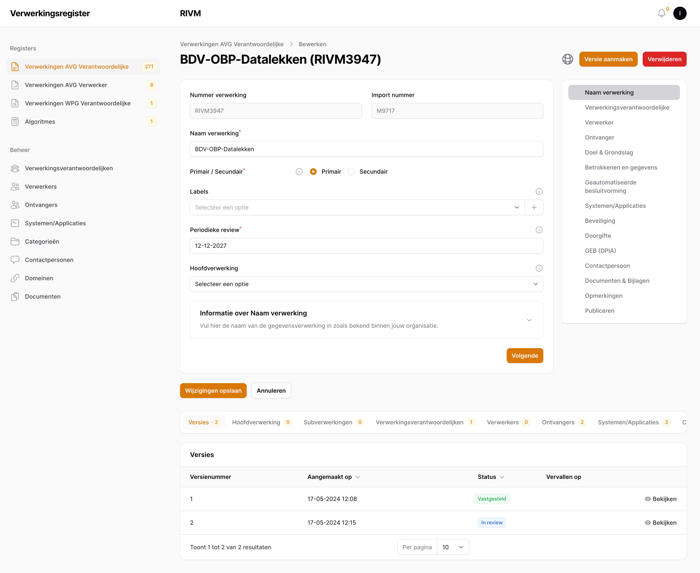

# Registers

Na het inloggen komt u in het verwerkingsregister en ziet u links in het scherm het navigatiemenu. Bovenaan staan de registers.

## AVG Verantwoordelijke Verwerkingen, AVG Verwerker Verwerkingen, WPG Verantoordelijke Verwerkingen

**Beschikbaar voor**: Invoerder, (Chief) Privacy Officer, Raadpleger, Functionaris Gegevensbescherming, Mandaathouder

In deze registers kunnen verwerkingen toegevoegd worden. Na het klikken op een register verschijnt er een overzicht van de verwerkingen in het register (Figuur \ref{fig:registers}) met de volgende kolommen waarop u de tabel kunt sorteren:

- *Nummer verwerking*: het unieke nummer van de verwerking;
- *Naam verwerking*: de naam van de verwerking;
- *Status*: de status van de versies van de verwerking;
- *Periodieke review*: de datum waarop de verwerking opnieuw een review moet ontvangen;

Als u op een verwerking klikt, of op de knop "Verwerking aanmaken", komt u op het bijbehorende invoerformulier, ook wel de detailpagina genoemd (Figuur \ref{fig:verwerking_detailpagina})

Op deze pagina zijn alle gegevens van een verwerking in te voeren en kunnen relaties gelegd worden tussen andere verwerkingen. Aan de rechterkant is een navigatiemenu voor de verschillende domeinen van gegevensinvoer.

> **Hint**: U kunt een verwerking opslaan zonder dat alle informatie is ingevoerd. Als een verwerking eenmaal klaar is voor het goedkeuringsproces kunt u een versie aanmaken welke middels het goedkeuringsproces vastgesteld kan worden nadat Mandaathouders een akkoord hebben gegeven. Voor meer informatie: zie Hoofdstuk \ref{Goedkeuringsproces}, "Goedkeuringsproces".

Eenmaal opgeslagen in het systeem zullen relaties met andere entiteiten zichtbaar zijn in de tabellen onderaan in het scherm. Hiermee kunt u snel navigeren naar de gerelateerde entiteiten.

> **Hint**: Het is mogelijk om verwerkingen te dupliceren met de knop rechtsbovenin: er wordt een nieuwe verwerking aangemaakt met precies dezelfde waardes voor alle velden. Dit maakt het makkelijk om meerdere verwerkingen in te voeren met grotendeels dezelfde eigenschappen: u hoeft alleen maar de velden te wijzigen waar de verwerkingen niet overenkomen.

## Algoritmes

**Beschikbaar voor**: Invoerder, (Chief) Privacy Officer, Raadpleger, Functionaris Gegevensbescherming, Mandaathouder

Het algoritmeregister werkt op identieke wijze als de verwerkingregisters. In de overzichtstabel zijn dezelfde kolommen zichtbaar omdat ze deze eigenschappen delen met de verwerkingen.

## Datalekken

**Beschikbaar voor**: Invoerder Datalekken, (Chief) Privacy Officer

In dit register kunnen datalekken toegevoegd worden. Na het klikken op het datalekregister verschijnt er een overzicht van alle datalekken in het register met de volgende kolommen waarop u de tabel kunt sorteren:

- *Nummer datalek*: het unieke nummer van de datalek;
- *Naam datalek*: de naam van de datalek;
- *Datum melding*: de datum van melding;
- *Gemeld aan de autoriteit persoonsgegevens (AP)*: een indicatie of het lek al dan niet gemeld is bij de AP;

Als u op een datalek klikt, of op de knop "Datalek aanmaken", komt u op het bijbehorende invoerformulier, ook wel de detailpagina genoemd.

> **Hint**: U kunt op de detailpagina aangeven of een datalek gemeld is bij de autoriteit persoonsgegevens (AP). Indien u aangeeft dat u dat gedaan heeft en de datalek opslaat, dan krijgen de Chief Privacy Officer(s) en Mandaathouder(s) van de organisatie automatisch een email met daarin een link naar deze datalek in het portaal.
