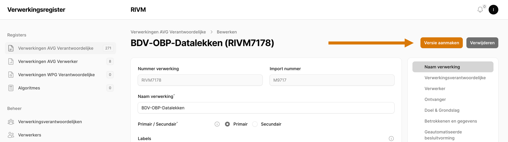
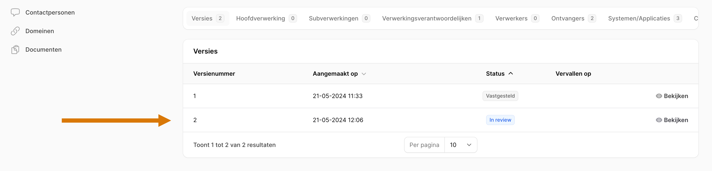
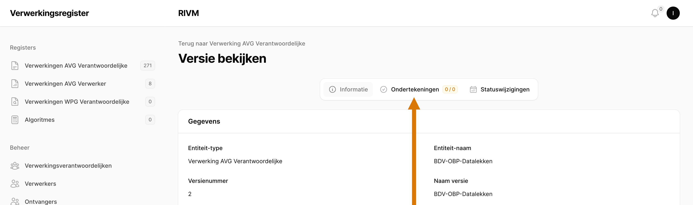
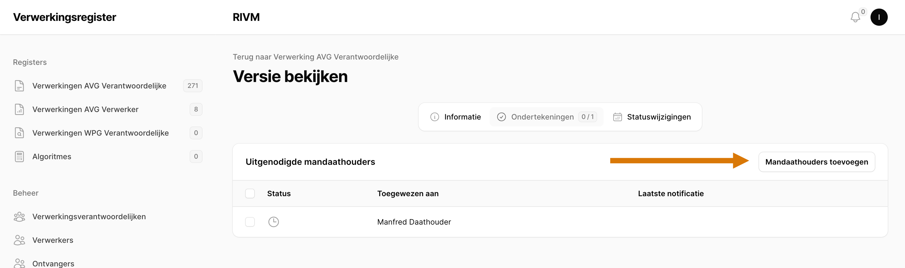
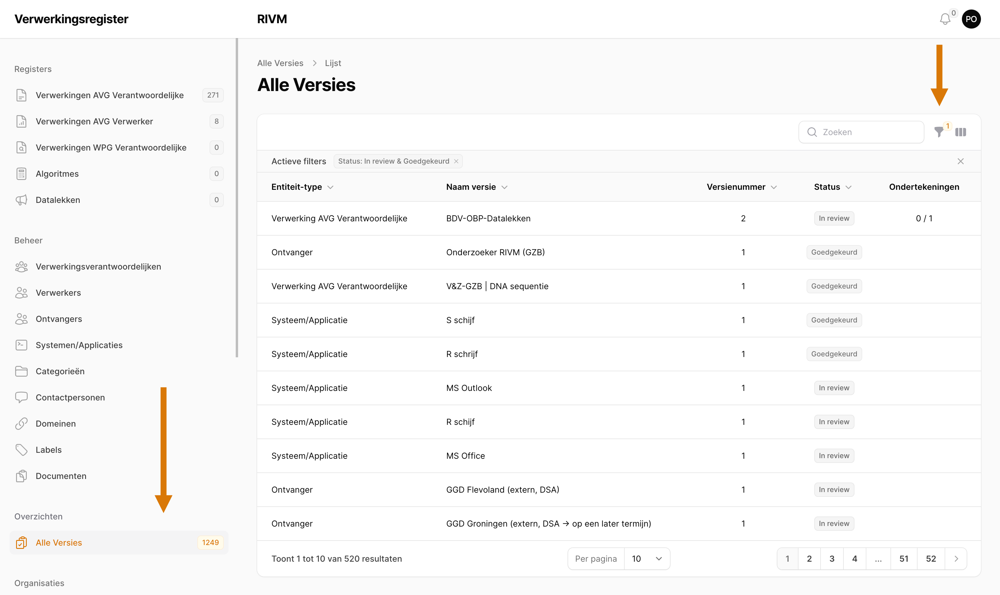
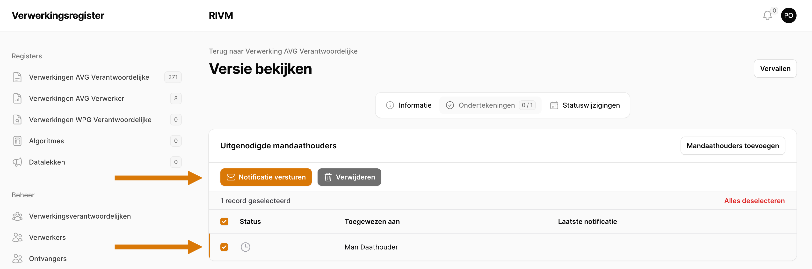
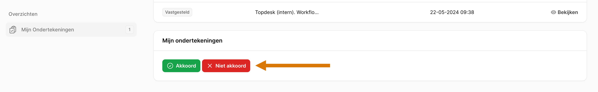

# Goedkeuringsproces\label{Goedkeuringsproces}

Het portaal ondersteunt het goedkeuringsproces van verwerkingen middels overzichten en automatisering:

- het aanmaken van versies en het aanpassen van de status van een versie
- het ophalen van een akkoord bij Mandaathouders op een goedgekeurde versie
- het vaststellen van versies met een akkoord
- overzichten van openstaande acties

Dit hoofdstuk beschrijft stap voor stap het goedkeuringsproces voor iedereen betrokken.

Een versie heeft altijd een status uit de volgende lijst:

1. \textcolor{blue}{"In Review"}: Deze versie is ingediend door een Invoerder en moet nog beoordeeld worden door een Privacy Officer
2. \textcolor{orange}{"Goedgekeurd"}: Deze versie is goedgekeurd door een Privacy Officer en mag worden aangeboden aan Mandaathouders voor akkoord.
3. \textcolor{green}{"Vastgesteld"}: Deze versie heeft goedkeuring van een mandaathouder gekregen en is daarmee vastgesteld.
4. \textcolor{gray}{"Vervallen"}: Deze versie is komen te vervallen, mogelijk omdat een nieuwere versie is aangemaakt die dezelfde status heeft verkregen.

## Versie aanmaken en Mandaathouders koppelen

**Beschikbaar voor**: Invoerder, Privacy Officer

Voor alle entiteiten in de registers en voor alle gerelateerde entiteiten is het mogelijk om een versie aan te maken.

Een nieuwe versie kan aangemaakt worden door een entiteit te openen en op de knop "Versie aanmaken" te klikken (Figuur \ref{fig:versie_aanmaken}, rechtsbovenin):

Een (nieuwe) versie is te vinden onderaan de pagina bij de tabellen op het eerste tabblad "Versies". De nieuw aangemaakte versie zal de status "In review" hebben (Figuur \ref{fig:versie_selecteren}):

Een klik op de versie zal de detailpagina van deze versie tonen. Hier kunnen Mandaathouders worden toegevoegd aan een versie door op "Ondertekeningen" te klikken (Figuur \ref{fig:ondertekeningen_selecteren}):

De knop "Mandaathouders toevoegen" toont een lijst met Mandaathouders: deze zijn te selecteren en kunnen worden toegevoegd met de knop "Toevoegen".

> **Let op**: Is eenmaal een versie aangemaakt, dan is de inhoud van deze versie niet meer aanpasbaar: slechts de status van een versie kan nog aangepast worden door een Privacy Officer. Indien er op een vastgestelde versie van een entiteit wijzigingen moeten worden aangebracht, dan is het de bedoeling dat de wijzigingen worden doorgevoerd in het formulier, de wijzigingen worden opgeslagen en er vervolgens een *nieuwe* versie wordt aangemaakt die door het goedkeuringsproces wordt geleid.

## Goedkeuren\label{sec:goedkeuren}

**Beschikbaar voor**: Privacy Officer

Het goedkeuren van een versie kan op de detailpagina van de desbetreffende versie. Het goedkeuren van een versie wil

Er is een overicht van alle versies te vinden in het navigatiemenu links (Figuur \ref{fig:versie_overzicht}). Deze tabel geeft een overzicht van alle versies en is te sorteren en filteren op *Entiteit-type*, *Naam versie*, *Versienummer* en *Status*.

De filter kan ingesteld worden rechtsboven in de tabel (Figuur \ref{fig:versie_overzicht}).

> **Hint**: Dit overzicht kan gebruikt worden als To Do lijst. Filter op alle versies die de status "In review" hebben: dit geeft een overzicht van alle nieuwe versies die zijn aangemaakt waar een Invoerder een goedkeuring op wil hebben.

Is eenmaal een versie geselecteerd, dan kan een versie met de status "In review" goedgekeurd worden met de knop "Goedkeuren" rechtsbovenin het scherm. Dit geeft aan dat deze versie is goedgekeurd door een Privacy Officer en mag worden aangeboden aan Mandaathouders voor akkoord.

## Mandaathouders uitnodigen voor ondertekening

**Beschikbaar voor**: Privacy Officer

Op de detailpagina op het tabblad "Ondertekeningen" (Figuur \ref{fig:mandaathouders_uitnodigen}) zijn Mandaathouders selecteerbaar met het vinkje ervoor. Zijn er Mandaathouders geselecteerd, dan verschijnt de knop "Notificatie versturen". Eenmaal bevestigd, zullen er emails naar de Mandaathouders gestuurd worden met een direct link naar deze versie.

## Akkoord geven

**Beschikbaar voor**: Mandaathouders

Een Mandaathouder kan akkoord geven op een versie door op de versie detailpagina onderaan op "Akkoord" te klikken (Figuur \ref{fig:akkoord_geven}). De Mandaathouder kan hier ook op "Niet akkoord" drukken, wat de mogelijkheid biedt om een notitie achter te laten.

## Vaststellen

**Beschikbaar voor**: Privacy Officer

Deze stap is identiek aan Sectie \ref{sec:goedkeuren} "Goedkeuren", met als enige verschil dat het hier "Vaststellen" betreft.

> **Hint**: Ook hier kan het overzicht gebruikt worden als To Do lijst. Filter op alle versies die de status "Goedgekeurd" hebben: kijk in de tabel of er al versies zijn met genoeg ondertekeningen om vastgesteld te worden.
