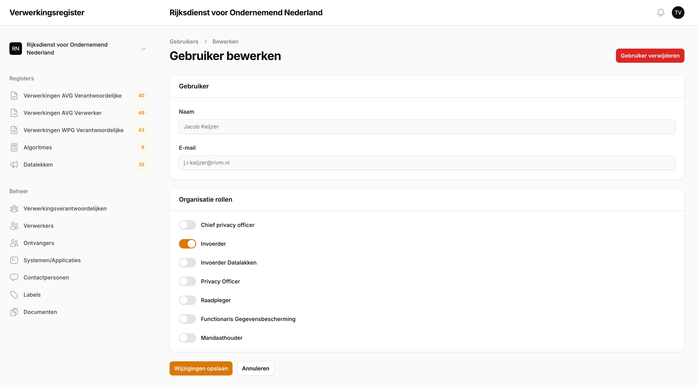

# Beheer

Het beheren van de applicatie bestaat uit het beheren van gebruikers, organisaties en de publieke website.

## Gebruikers

**Beschikbaar voor**: Privacy Officer, Chief Privacy Officer, Functioneel Beheerder

In het Gebruiker detailscherm (Figuur \ref{fig:gebruikers_beheer}) kan voor iedere gebruiker de naam en het emailadres aangepast worden. Daarnaast is dit het scherm waar rollen worden toegewezen aan de gebruiker waarmee bepaalde rechten worden toegkend.

### Globale Rollen

**Beschikbaar voor**: Functioneel Beheerder

Een gebruiker kan onder "Globale rollen" de rol Chief Privacy Officer of Functioneel Beheerder worden toegewezen.

### Rollen binnen een Organisatie

**Beschikbaar voor**: Privacy Officer, Chief Privacy Officer, Functioneel Beheerder

Een gebruiker kan onder "Organisatie rollen" de rollen Invoerder, Privacy Officer, Functionaris Gegevensbescherming, Raadpleger en Mandaathouder toegekend worden.

Om een rol binnen een organisatie toe te voegen, klik dan eerst op "Organisatie rol toevoegen" en kies dan de organisatie uit de drop-down. Vink dan vervolgens de rollen aan en sla de wijzigingen op.

### 2FA uitschakelen

**Beschikbaar voor**: Privacy Officer, Chief Privacy Officer, Functioneel Beheerder

Het kan zijn dat een gebruiker geen toegang meer heeft tot het platform omdat de Authenticator niet meer werkt. In dit geval kan je de 2FA uitschakelen door op de knop "2FA uitschakelen" te drukken, rechts bovenaan het Gebruiker detailscherm.

## Organisaties

**Beschikbaar voor**: Chief Privacy Officer, Functioneel Beheerder

Organisaties kunnen worden aangemaakt, waarna ze in een tabel verschijnen. Door op een organisatie te klikken, wordt de detailpagina geopend. Hier kunnen algemene gegevens zoals de naam, de standaardperiode voor periodieke reviews (in maanden) en de verantwoordelijke rechtspersoon worden aangepast. Daarnaast kunnen ook de prefix en gegevens van de publieke website worden aangepast.

### Prefix

Iedere verwerking en elk datalek krijgt een uniek nummer, waarvan de prefixen kunnen worden gespecificeerd. De prefixes mogen alleen uit hoofdletters bestaan. Let op: een prefix kan in dit systeem maar één keer worden gekozen, zodat de unieke nummering gegarandeerd blijft. Wees dus zorgvuldig bij het invullen van de prefixes.

> **Hint**: Vul hier een prefix in die te herleiden is naar uw organisatie, e.g. "RIVM" of "CIBG". Voor datalekken zijn apart prefixes te specificeren, dus maak deze net zo goed herleidbaar naar de organisatie maar desalniettemin uniek, e.g. "RIVMD" of "CIBGD".

\newpage
### Publieke website (organisatie)

Hier zijn de volgende gegevens aan te passen:

- *Url Segment*: In dit invoerveld is het url segment te specificeren van de organisatie.
- *Publiceer vanaf*: In dit invoerveld is een datum te specificeren: vanaf die dag zal de organisatie getoond worden op de publieke website. Een leeg invoerveld betekent dat de organisatie niet gepubliceerd zal worden op de publieke site. Deze datum is aan te passen, dus een organisatie is te verwijderen van de publieke website door de datum in de toekomst te specificeren of leeg te maken.
- *Tekst publieke website en Poster*: In het tekst-invoerveld is de tekst te specificeren die op de publieke website getoond wordt bij de organisatie. Het is mogelijk "rich text" in te voeren in het invoerveld, d.w.z. dat er beschikking is tot opmaak en het toevoegen van links, naar bijvoorbeeld een privacyverklaring. Voor de poster is er een image te uploaden welke gebruikt wordt bij de publieke website, zowel bij het overzicht van alle organisaties als bij de organisatiepagina zelf. Indien hier geen image wordt geupload zal er een standaard image worden gebruikt.

## Publieke Website (home)

**Beschikbaar voor**: Chief Privacy Officer

In het tekst-invoerveld is de tekst te specificeren die op de publieke website getoond wordt bij overzichtspagina van alle organisaties. Het is mogelijk "rich text" in te voeren in het invoerveld, d.w.z. dat er beschikking is tot opmaak en het toevoegen van links.
