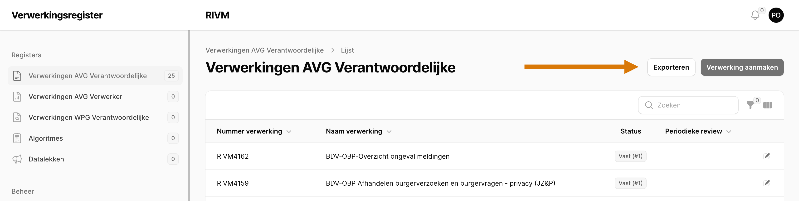
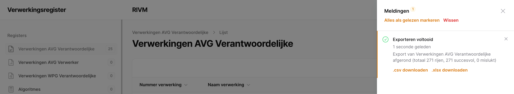

# Overige Functies

Het portaal biedt een aantal overige functies zoals het kunnen importeren vanuit het [AVG Register Rijksoverheid](https://www.avgregisterrijksoverheid.nl/) systeem of het exporteren naar sheets voor het maken van overzichten.

## Import

**Beschikbaar voor**: Privacy Officer

Het [AVG Register Rijksoverheid](https://www.avgregisterrijksoverheid.nl/) biedt de mogelijkheid om exports te maken van verwerkingen. Deze zip-files zijn direct te importeren met de "import" functionaliteit.

## Export

**Beschikbaar voor**: Privacy Officer

Het Verwerkingsregister biedt de mogelijkheid om registers te exporteren naar een `.csv` of `.xlsx` bestand. De knop voor het exporteren zit boven de overzichtstabel van ieder register (Figuur \ref{fig:export}).

Is de export voltooid, dan zal er een notificatie getoond worden in het scherm rechts bovenin. De links naar de files zijn te vinden in het notificatie-overzicht (Figuur \ref{fig:export_complete}).

## Opzoeklijsten

**Beschikbaar voor**: Privacy Officer

In het systeem zijn er meerdere velden waar er slechts een keuze mogelijk is uit een beperkte set opties. Onder "Opzoeklijsten" zijn deze velden te vinden en zijn hun opties aan te passen.

In deze opzoeklijsten zijn nieuwe waardes aan te maken, opties in of uit te schakelen en opties te verwijderen. Op de detailpagina van een optie is een tabel te vinden van alle entiteiten waar deze optie is geselecteerd.

> **Let op:** Het verwijderen van een optie verwijdert deze compleet uit het systeem! Dit betekent dat overal waar de optie geselecteerd was, nu niets meer geselecteerd is. Als dit niet de bedoeling is, wilt u de optie waarschijnlijk uitschakelen: de optie is dan niet meer te selecteren, maar entiteiten waar deze optie eerder geselecteerd was, blijven ongewijzigd.
